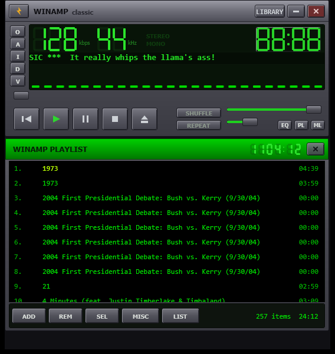

# New Winamp Classic

<p align="center">
  
</p>

<p align="center">
  <em>"It really whips the llama's ass!"</em>
</p>

<p align="center">
  
  
  
  
  
  <a href="https://github.com/uponatime2019/NewWinampClassic/releases/latest"></a>
</p>

---

## 📥 Download & run — no install needed

The quickest way to try New Winamp Classic:

1. Grab **`NewWinampClassic-vX.Y.Z-win-x64.zip`** from the [latest release](https://github.com/uponatime2019/NewWinampClassic/releases/latest)
2. Right-click → **Extract All…**
3. Double-click **`NewWinampClassic.exe`** — that's it. Portable, no installer, no admin rights, and no .NET download required (the runtime is bundled).

> **First launch?** Windows SmartScreen may show *"Windows protected your PC"* because the app isn't code-signed — click **More info → Run anyway**.

---

## 🌟 Overview

**New Winamp Classic** is a modern, open-source, unpackaged Windows desktop music player that resurrects the iconic and beloved Winamp 2.x experience using contemporary Windows technologies: **C#**, **.NET 8**, **WinUI 3**, and **Windows App SDK**.

It pairs the nostalgic retro look and feel—metallic brushed faceplates, green 7-segment LCD readouts, spectrum analyzer, and detachable-style windows—with a modern audio pipeline powered by [NAudio](https://github.com/naudio/NAudio), an embedded SQLite media library, and online music search.

---

## ✨ Features

### 🎛️ Classic Modular Player
* **Authentic Retro Aesthetic**: Faithfully recreated Winamp 2.x interface with custom metallic gradients, bevels, and vintage control styling.
* **Detachable-Style Window Panels**:
  * **Main Player**: Transport controls, volume/balance sliders, seek bar, shuffle, repeat, and clutterbar (`O`, `A`, `I`, `D`, `V`).
  * **Equalizer (EQ)**: 10-band parametric equalizer with preamp and real-time response curve.
  * **Playlist Editor (PL)**: Drag-and-drop track list, duration counter, track management, and sorting tools.
  * **Media Library (ML)**: Tabbed navigation housing your local music collection and downloads.
* **Green LCD Readouts**: Classic 7-segment digital displays for elapsed/remaining playback time, bitrate (kbps), and sampling rate (kHz).
* **Marquee Title Ticker**: Smooth-scrolling marquee ticker displaying track artist, title, album, and duration.
* **Custom Window Controls**: Frameless window dragging, always-on-top toggle, and double-size UI toggle.

### 🎧 Audio & Equalizer Engine
* **High-Fidelity Playback**: Streaming playback pipeline powered by NAudio with support for MP3, FLAC, WAV, OGG, M4A, AAC, WMA, OPUS, and AIFF.
* **10-Band Parametric Equalizer**: Custom biquad peaking filters across 10 bands: `60 Hz`, `170 Hz`, `310 Hz`, `600 Hz`, `1 kHz`, `3 kHz`, `6 kHz`, `12 kHz`, `14 kHz`, and `16 kHz`.
* **Preamp & Balance**: Adjustable preamp boost/cut (-12 dB to +12 dB) and stereo balance adjustment.
* **Built-in Presets**: 16 classic EQ presets including Flat, Rock, Pop, Classical, Club, Dance, Full Bass, Full Treble, Live, Party, Techno, and more.

### 📊 Real-Time Audio Visualizers
* **Winamp Classic Spectrum Analyzer**: 16-segment green LCD frequency analyzer with peak fall physics.
* **32-Band Visualizer Control**: Multi-mode visualizer supporting 11 distinct styles (bottom bars, centered, mirrored, wave line, circular).
* **Cooley-Tukey FFT**: Real-time Radix-2 Fast Fourier Transform analysis on stereo/mono audio streams.

### 📑 Playlist Editor
* **Drag-and-Drop Reordering**: Rearrange playlist tracks seamlessly with mouse drag-and-drop.
* **Track Operations**: Add files or folders, crop selected, remove tracks, clear playlist, invert selection.
* **Sorting & Shuffling**: Sort by title, artist, or filename, or randomize playback order.
* **Dead-File Cleanup**: Quickly detect and purge missing or relocated music files.

### 📚 SQLite Media Library
* **Automatic Folder Scanning**: Scans configured music libraries recursively in the background.
* **ID3 & Tag Extraction**: Leverages [TagLibSharp](https://github.com/mono/taglib-sharp) to read metadata and extract embedded cover art.
* **Local SQLite Database**: Indexes songs, albums, artists, genres, playlists, and play history.
* **Search & Favorites**: Instant incremental search and one-click favorites toggling.

### ☁️ Online Search & Streaming
* **SoundCloud Integration**: Search tracks online, stream directly, or download to local disk with real-time download progress tracking.

---

## 🛠️ Tech Stack & Dependencies

| Component | Technology |
|---|---|
| **Target Framework** | .NET 8.0 (`net8.0-windows10.0.19041.0`) |
| **UI Framework** | WinUI 3 (Windows App SDK 2.4) |
| **Package Type** | Unpackaged Win32 Desktop Application |
| **Audio Processing** | NAudio 2.2.1 |
| **Metadata & ID3** | TagLibSharp 2.3.0 |
| **Database** | SQLite (`Microsoft.Data.Sqlite` 9.0, `SQLitePCLRaw.bundle_e_sqlite3`) |
| **MVVM Architecture** | CommunityToolkit.Mvvm 8.4.2 |
| **Dependency Injection** | Microsoft.Extensions.DependencyInjection 9.0 |
| **Logging** | Serilog 4.2 with rolling daily file sink |

---

## 🚀 Getting Started

### Prerequisites
* Windows 10 (version 1809 or higher, build 17763+) or Windows 11
* [.NET 8.0 SDK](https://dotnet.microsoft.com/download/dotnet/8.0)
* [Windows App SDK Runtime](https://learn.microsoft.com/en-us/windows/apps/windows-app-sdk/downloads) (1.4+ or 2.x)

### Clone & Build

1. Clone the repository:
   ```bash
   git clone https://github.com/your-username/NewWinampClassic.git
   cd NewWinampClassic
   ```

2. Build the project using the .NET CLI:
   ```powershell
   dotnet build NewWinampClassic.csproj -p:Platform=x64
   ```

3. Run the application:
   ```powershell
   dotnet run --project NewWinampClassic.csproj -p:Platform=x64
   ```

   *Alternatively, open `NewWinampClassic.sln` in Visual Studio 2022 and press **F5**.*

---

## 📁 Project Structure

```
New Winamp Classic/
├── Assets/                 # Application icons, logos, and screenshots
│   └── screenshot.png      # Hero screenshot
├── Controls/               # Custom UI controls
│   ├── AudioVisualizerControl.cs # 32-band multi-mode audio visualizer
│   ├── ClassicSlider.cs          # Winamp-styled textured fader slider
│   ├── LcdNumber.cs              # 7-segment green LCD digital readout
│   ├── MusicVisualizerControl.xaml # Extended visualizer canvas
│   └── WinampSpectrum.cs         # Winamp classic LCD spectrum analyzer
├── Data/                   # Database access layer
│   ├── DatabaseInitializer.cs   # SQLite schema and index migrations
│   ├── ISongRepository.cs        # Song repository interface
│   ├── SettingsRepository.cs    # App configuration persistence
│   └── SongRepository.cs        # Fast SQLite song CRUD operations
├── Helpers/                # Converters, artwork cache, and utility helpers
├── Models/                 # Domain entities (Song, Album, Artist, Playlist, etc.)
├── Services/               # Core services
│   ├── AudioPlaybackService.cs  # Streaming audio engine (NAudio)
│   ├── EqProvider.cs            # 10-band parametric EQ filter chain
│   ├── MusicLibraryService.cs   # Folder scanning & TagLibSharp parsing
│   ├── QueueService.cs          # Playlist queue, shuffle, and repeat modes
│   ├── SampleAggregator.cs      # FFT calculation and sample buffering
│   └── SoundCloudService.cs     # Online search and download client
├── ViewModels/             # MVVM ViewModels
├── Views/                  # WinUI 3 XAML navigation pages
│   ├── AlbumsPage.xaml
│   ├── ArtistsPage.xaml
│   ├── DownloadsPage.xaml
│   ├── FavoritesPage.xaml
│   ├── HomePage.xaml
│   ├── LibraryPage.xaml
│   ├── PlaylistsPage.xaml
│   ├── RecentlyPlayedPage.xaml
│   ├── SearchPage.xaml
│   └── SettingsPage.xaml
├── App.xaml / .cs          # Application entry point, DI setup, and lifecycle
├── MainWindow.xaml / .cs   # Classic retro shell window
├── NewWinampClassic.csproj # Unpackaged WinUI 3 project configuration
├── NewWinampClassic.sln    # Visual Studio solution file
├── app.manifest            # DPI awareness and OS compatibility manifest
├── LICENSE                 # MIT License
└── README.md               # Project documentation
```

---

## ⌨️ Clutterbar & Controls Quick Reference

| Button / Key | Description |
|---|---|
| **O** | Open audio file(s) or folder |
| **A** | Toggle Always-on-Top |
| **I** | Toggle Media Library window |
| **D** | Toggle 2x Double Size scale |
| **V** | Cycle visualization mode |
| **EQ** | Show/Hide 10-band Equalizer window |
| **PL** | Show/Hide Playlist Editor window |
| **ML** | Show/Hide Media Library window |
| **Click Time Display** | Toggle Elapsed vs. Remaining track time |

---

## 📄 License

This project is licensed under the **MIT License** — see the [LICENSE](LICENSE) file for details.

---

<p align="center">
  Made with ❤️ for classic Winamp enthusiasts.
</p>
